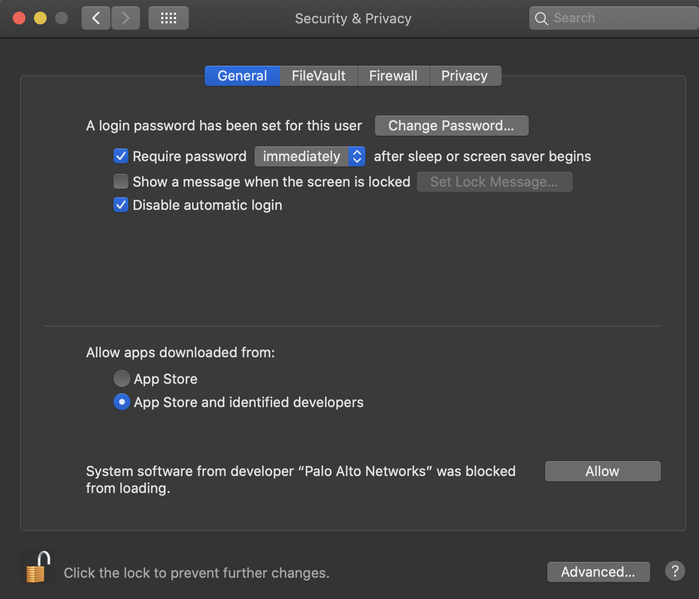
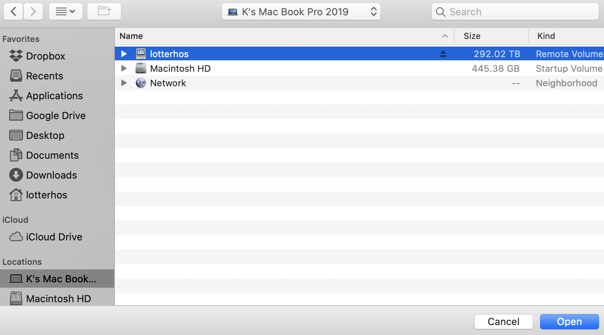

#  Lotterhos Lab vs. Personal Storage on Discovery


* We have **active** storage (10 TB) that should be used for 'active' projects, and **archival** storage for storing 
raw files and outputs from projects. Please be smart about how you use archival storage and work with Dr. Lotterhos to 
make sure only relevant files are being archived.

* In addition each user has a home directory and a scratch directory.

### Your home directory on Discovery**.  
* Path: `/~/` or `/home/username`
* Note that only you have access to these files.

### Your scratch directory on Discovery**. Use this for intermediate outputs that are not backed up. 
* Path: `/scratch/username`
 * Note that only you have access to these files.

### Lotterhos shared storage on Discovery
* /work/lotterhos/
* Katie will create a folder for each lab project in this directory. For each folder, Katie will submit a ticket to research computing to ask them to create a group for the project with members who will have access to that folder.

Example:
```
mkdir BlackSeaBass                  # make the folder
chgrp lotterhos-BSB BlackSeaBass    # change the group on the directory
chmod 775                           # give group permissions to the directory
```

* Groups
 * `lotterhos` - all Lotterhos Lab members
 * `lotterhos-BSB` - access to Black Sea Bass project

Working with github:

### GitHub Enterprise
* To do: Set up a time to talk to Raphael

### Archival Lotterhos Lab storage** (25 TB for lab). Northeastern NESE collection. 
* Path: `/lotterhosarchive/`
* TO DO: FIGURE OUT WHAT TO DO ABOUT SARA's COD BACKUPS ON SMB/LOTTERHOS - ASK JAMES
* Within this storage space we will have a shared folder for each project, that only the people on that project will have access to.

### Active Lotterhos Lab storage: more information** (? TB for lab).  
* smb://nunet.neu.edu/rc-shares/lotterhos/
* Ask Katie to share a Globus endpoint with you. The endpoint with include the words "smb Volumes/lotterhos"
* Within this storage space we have a shared folder for each project, that only the people on that project have access to.
 * For this endpoint to work, it has to be mapped through Katie's laptop or the iMac in the lab. _Katie's laptop from home: sign into NU VPN, make sure Globus Connect Personal App is running, plug in ethernet cord_
* Because accessing this server is done through a computer, it makes transferring files specific to the computer that the server is mapped to. Typically, you will ask Katie to share the Globus endpoint for this server that is set up through the lab iMac. As long as the server is mapped to the computer (typically lab iMac) and that connection is not interrupted, you should have no problems. 
 * From a laptop or over wifi, transfers of large files are very slow. This is why we map to the server through the iMac. The point of all the steps we outline below is so we can use Globus to transfer files from the smb drive to Discovery.
* To connect to the smb server, follow these directions to map to the server on a computer [this document](accessing_shared_storage_2020.pdf) (typically Katie only)
* Setting up a Globus endpoint for the folder to share (typically Katie only)
 * _Intitial step if Globus personal endpoint for the computer is not set up_: Download and install the Globus Connect Personal App. In Globus web app, click on "Add a personal endpoint" and enter the key in the Desktop app.
 * _Intial setup if working from a home laptop_: Use GlobalProtect to establish a VPN connection (vpn.northeastern.edu) (if you are having trouble establishing the VPN connection on a Mac, check your Security and Permissions settings and give the app permissions, see image). Then you should be able to map to the server. 
  *  
 * Step 1: In the Globus Desktop App, then go to Preferences-> Access and click the "+" sign. On a Mac, at the top center click on the bar, click on the name of the computer, and you should see the mapped server there as a volume `Volumes/lotterhos`. Click on it and add it to the list.
  * 
 * Step 2: In the Globus Web App, go to the endpoint for the computer. Then type `Volumes/lotterhos/` in the path. Save it as a bookmark.
 * Step 3: Before you can conduct file transfers from a personal endpoint, you need to have a "Globus Plus Account". Email James Macalino at NU research computing to get added. You will then receive an email.

