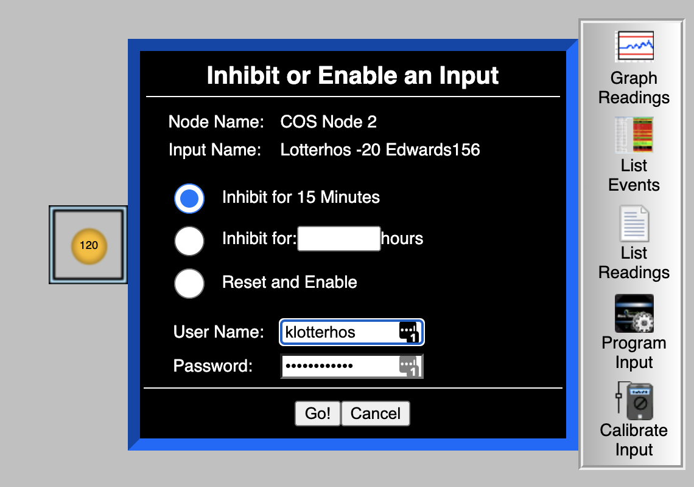

## Freezer alarm system

NU contact: Dennis Todd

Here is the link for the Rees system.

http://NOR926.ReesCloud.net

Your logins are first initial, last name/names. All lowercase with no spaces or extra characters, just letters. 

[phone alarm handling instructions](img/PhoneAlarmHandlingInstructionsCentronNUcontactDennisTodd.pdf)

Your pin codes to acknowledge alarms received on your phone is described below.

When you log in, our freezers are labeled 120 (the -80C in Edwards) and 121 (the -20C in Edwards)

### The alarm will go off when the freezer falls below -70C

## If you plan on loading samples in the freezer

Click on "Manage Alarm"

Disable the alarm for an hour or so (there is a max that is allowable, but not sure what it is). 

Please be careful not to let the temperature drop while you are loading samples. If the temperature reaches -65C, wait until it gets back up to -75C before you load more samples. It puts a lot of stress on the freezer.

## If you plan to defrost the freezer

we need to contact Dennis Todd to request a 24hr+ freezer alarm shutoff.

