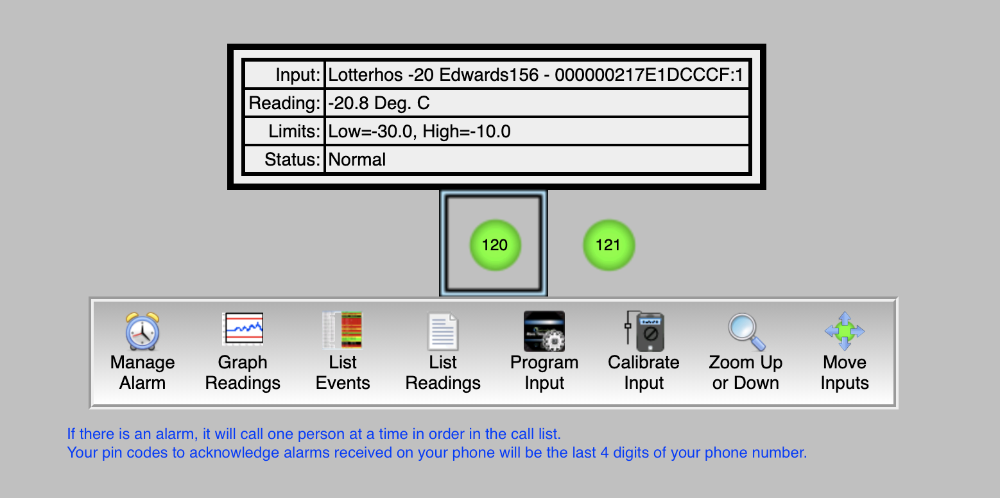

## Freezer alarm system

NU contact: Dennis Todd

Here is the link for the Rees system.

http://NOR926.ReesCloud.net

Your logins are first initial, last name/names. All lowercase with no spaces or extra characters, just letters. 

[phone alarm handling instructions](img/PhoneAlarmHandlingInstructionsCentronNUcontactDennisTodd.pdf)

Your pin codes to acknowledge alarms received on your phone is described below.

When you log in, our freezers are labeled 120 (the -20C in Edwards) and 121 (the -80C in Edwards)

### The alarm will go off when the freezer rises above -70C

## If you plan on loading samples in the freezer

Click on "Manage Alarm"

Disable the alarm for an hour or so (there is a max that is allowable, but not sure what it is). 

Please be careful not to let the temperature drop while you are loading samples. If the temperature reaches -65C, wait until it gets back up to -75C before you load more samples. It puts a lot of stress on the freezer.

## If you plan to defrost the freezer

we need to contact Dennis Todd to request a 24hr+ freezer alarm shutoff.

----------------------------------------
----------------------------------------

# Defrosting the -80C freezer

[CryoCube-F570 operating manual](https://github.com/DrK-Lo/lotterhoslabprotocols/files/7305953/Freezers_Operating-manual_CryoCube-F570n-h-hw.pdf)

## To do ahead of time:

1) find a backup freezer for the samples and confirm that there's enough space for all contents of our freezer; check the dimensions of the available shelves in the backup freezer to see if it is the same as ours (ideally, transfer whole racks to the equivalent shelf & rack position on the backup freezer to save time and avoid messing up the inventory).

2) find help - defrosting can be done by one person, but having a second pair of hands is very helpful and strongly recommended.

3) familiarize yourself with the protocol to disable freezer alarms (see above), with the materials that need to be on hand to defrost & clean the freezer and the overall protocol/timeline described below.

## The day of transfer/defrost:

4) before you begin, double-check that the backup freezer(s)' alarm was disabled; request that our alarm is disabled remotely for 24h by emailing Dennis Todd @ northeastern, and gather: 
    - freezer mittens
    - lab cart
    - a mop or large towel
    - 'wet floor' sign
    - a cooler or large styrofoam box for lose boxes/bags
    - a bucket to collect water 
    - clean cloths to wipe the freezer 

5) **WEARING FREEZER MITTENS**, transfer whole racks to the backup freezer: place all 5 racks from one shelf on our lab cart; roll the cart to the backup freezer and place them on **the equivalent shelf and in the same order as they were on our freezer**. Do this one shelf at the time until the freezer is empty.
> transfer racks in and out of freezers carefully but quickly to minimize temp rising - note that the drawers slide open, so keep the racks horizontal; monitor both freezer's temp as you transfer - shouldn't rise above -65oC.

6) once empty: 
  - put up a "wet floor" sign, 
  - close the CO2 cylinder valve,
  - switch off the local alarm box located on top of the freezer,
  - unlock the switch locking plate (front-bottom-right side of the freezer) and switch off the battery (top) and the main (bottom) switches,
  - unplug the freezer from the wall,
  - open all doors and let the freezer defrost, use a bucket to catch water dripping from the doors, use a mop to dry up the puddles.

7) once defrosted: wipe the whole interior of the freezer, the inner and outer doors and the seal using clean microfiber cloths (under the lab sink) until completely dry. 

8) reverse: close all doors, plug freezer back up, switch on main switch/battery switch and lock up the locking plate, switch on alarm box up on top of the freezer. Monitor temperature to ensure that it is appropriately decreasing all the way to -80oC.
  > during this stage, the freezer alarm may go off (not the alarms associated with the remote system), just mute it using the door pannel keys. 

## Example timeline:

October 2021 defrost (Thais, Sara and Alan): 
  - OGL was able to hold our samples (**MUST** coordinate with OGL personnel ahead of time); OGL's freezers was completely empty, and shelves have the same dimensions as ours (plus an extra shelf). 
  - We were able to transfer all racks to the equivalent positions into the backup freezer (one shelf at the time) without needing to wait too long for the temperature to stabilize. Because the backup freezer was empty, the temp rose to -58oC when we transferred the first shelf/5 racks. 
  - Our freezer was defrosted, cleaned/dried and turned back on within 2 hours. Transfer-defrost-cleaning took from 11am to 2pm.
  - Temp down to -80oC within another 2-3 hours. 
  - The CO2 valve was reopened the following day.

----------------------------------------
----------------------------------------

# Freezer maintenance

maintenance has been done with https://alertscientific.com/

